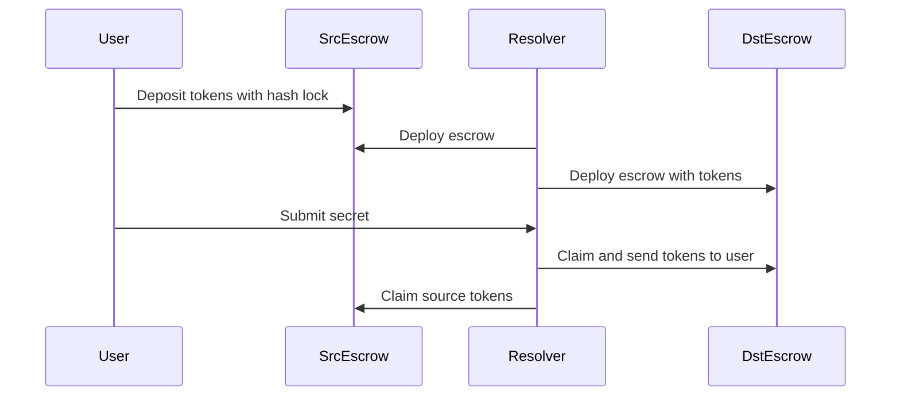

## What are Atomic Swaps?

Atomic swaps are a cryptographic protocol that enables the exchange of tokens across different blockchains in an all-or-nothing manner. In the context of 1inch Fusion+, atomic swaps guarantee that either the complete cross-chain transfer happens successfully, or no transfer occurs at all—there's no possibility of partial execution where tokens are lost or stuck.

<Info>
The "atomic" property means the swap is indivisible: both the source chain and destination chain transfers must complete, or neither will happen.
</Info>

## How 1inch Fusion+ Implements Atomic Swaps

1inch Fusion+ uses a sophisticated escrow-based mechanism to achieve atomic cross-chain swaps:

### Escrow Contracts

The system deploys escrow contracts on both the source and destination chains:

- **Source Escrow**: Holds the user's tokens on the originating blockchain
- **Destination Escrow**: Holds the resolver's tokens on the target blockchain

These escrows act as trustless intermediaries that enforce the swap conditions through smart contract logic.

```typescript
// Example: Creating a cross-chain swap from Polygon to BSC
const quote = await sdk.getQuote({
  amount: '10000000',
  srcChainId: NetworkEnum.POLYGON,
  dstChainId: NetworkEnum.BINANCE,
  enableEstimate: true,
  srcTokenAddress: '0xc2132d05d31c914a87c6611c10748aeb04b58e8f', // USDT on Polygon
  dstTokenAddress: '0xeeeeeeeeeeeeeeeeeeeeeeeeeeeeeeeeeeeeeeee', // BNB
  walletAddress
})
```

### The Role of Resolvers

Resolvers are specialized actors in the 1inch Fusion+ network that facilitate cross-chain swaps:

1. **Order Matching**: Resolvers monitor pending swap orders and choose which ones to execute
2. **Escrow Deployment**: They deploy both source and destination escrow contracts
3. **Liquidity Provision**: Resolvers provide the destination tokens upfront
4. **Execution**: After the user reveals their secret, resolvers can claim the source tokens

<Note>
Resolvers are incentivized through the auction mechanism—they compete to fulfill orders at the best rates while earning the rate differential as profit.
</Note>

### Execution Flow



## Security Guarantees

### Trustless Execution

Atomic swaps in 1inch Fusion+ require no trust between parties:

- **No Custody**: Neither the resolver nor any third party takes custody of user funds
- **Smart Contract Enforcement**: All swap conditions are enforced by audited smart contracts
- **Hash Lock Protection**: Secrets ensure that only authorized parties can claim funds

<Warning>
Always verify escrow addresses before submitting secrets. The SDK provides methods to check escrow deployments through `getReadyToAcceptSecretFills()`.
</Warning>

### No Intermediaries

The system operates without trusted intermediaries:

- Users maintain control of their secrets
- Resolvers cannot access funds without the correct secret
- Smart contracts automatically enforce timeout and cancellation rules
- Refunds are guaranteed if the swap doesn't complete within the time window

### Atomic Property Enforcement

**Success Case**: Both transfers complete
- User receives destination tokens
- Resolver receives source tokens

**Failure Case**: No transfers occur
- If the resolver doesn't deploy escrows in time, the order expires
- If the user doesn't provide secrets, resolvers can cancel and reclaim their funds
- If timeouts occur, users can reclaim their source tokens

<Info>
The time lock mechanism ensures that all parties have windows to act, with fallback cancellation options if any step fails.
</Info>

## Benefits of Atomic Swaps

1. **Security**: Cryptographic guarantees prevent loss of funds
2. **Decentralization**: No centralized bridge or custodian required
3. **Trust Minimization**: Only trust smart contract code, not third parties
4. **Censorship Resistance**: Cannot be blocked by intermediaries
5. **Guaranteed Settlement**: Either completes fully or refunds automatically

## Related Concepts

- [Hash Locks](/concepts/hash-locks): Learn how secrets secure atomic swaps
- [Secrets](/concepts/secrets): Understanding secret generation and management
- [Presets](/concepts/presets): Configure swap speed and cost parameters
