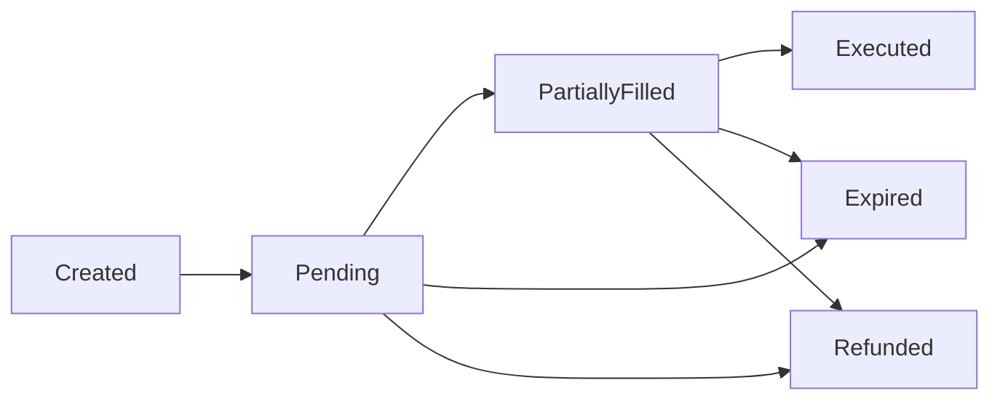

Order tracking is essential for monitoring the progress of cross-chain swaps and ensuring secrets are submitted at the right time. This guide covers the order lifecycle, status checking, and secret management.

## Order Lifecycle

Cross-chain orders progress through several states:



### Order States

| Status | Description | Action Required |
|--------|-------------|----------------|
| **Created** | Order created but not yet submitted | Submit order |
| **Pending** | Order submitted, waiting for resolver | Monitor for escrows |
| **PartiallyFilled** | Some fills completed | Submit remaining secrets |
| **Executed** | All fills completed successfully | None - swap complete |
| **Expired** | Order expired before completion | Check for refunds |
| **Refunded** | Order refunded to user | None - funds returned |

## Getting Order Status

Use `getOrderStatus()` to check the current state of an order:

```typescript
const status = await sdk.getOrderStatus(orderHash)

console.log('Order status:', status.status)
console.log('Fills:', status.fills)
```

### Status Response Structure

```typescript
interface OrderStatusResponse {
    status: OrderStatus
    orderHash: string
    fills: Fill[]
    createdAt: number
    // ... other fields
}

enum OrderStatus {
    Created = 'created',
    Pending = 'pending',
    PartiallyFilled = 'partially-filled',
    Executed = 'executed',
    Expired = 'expired',
    Refunded = 'refunded'
}
```

## Secret Management

Secrets are the cryptographic keys that allow resolvers to complete the swap. You must submit secrets when escrows are ready.

### Checking for Ready Escrows

Use `getReadyToAcceptSecretFills()` to check which secrets need to be submitted:

```typescript
const secretsToShare = await sdk.getReadyToAcceptSecretFills(orderHash)

if (secretsToShare.fills.length > 0) {
    console.log(`${secretsToShare.fills.length} escrows ready for secrets`)
    
    for (const { idx } of secretsToShare.fills) {
        console.log(`Secret ${idx} needed`)
    }
}
```

### Submitting Secrets

Once escrows are deployed, submit the corresponding secrets:

```typescript
for (const { idx } of secretsToShare.fills) {
    // Verify escrow details before submitting
    await sdk.submitSecret(orderHash, secrets[idx])
    console.log(`Submitted secret ${idx}`)
}
```

<Warning>
  Always verify escrow addresses and parameters before submitting secrets. The `getReadyToAcceptSecretFills()` response includes escrow details for verification.
</Warning>

## Complete Monitoring Loop

Here's a complete example of monitoring an order and submitting secrets:

<CodeGroup>
```typescript Basic Monitoring Loop
import { SDK, OrderStatus } from '@1inch/cross-chain-sdk'

async function monitorOrder(
    sdk: SDK,
    orderHash: string,
    secrets: string[]
): Promise<void> {
    const alreadyShared = new Set<number>()

    while (true) {
        // Check for ready escrows
        const secretsToShare = await sdk.getReadyToAcceptSecretFills(orderHash)

        // Submit new secrets
        if (secretsToShare.fills.length) {
            for (const { idx } of secretsToShare.fills) {
                if (!alreadyShared.has(idx)) {
                    // It is your responsibility to verify escrow addresses
                    await sdk.submitSecret(orderHash, secrets[idx])
                    alreadyShared.add(idx)
                    console.log(`Submitted secret ${idx}`)
                }
            }
        }

        // Check order status
        const { status } = await sdk.getOrderStatus(orderHash)
        console.log('Current status:', status)

        // Exit when order is complete
        if (
            status === OrderStatus.Executed ||
            status === OrderStatus.Expired ||
            status === OrderStatus.Refunded
        ) {
            console.log('Order completed with status:', status)
            break
        }

        // Wait before next check
        await new Promise(resolve => setTimeout(resolve, 1000))
    }
}

// Usage
await monitorOrder(sdk, orderHash, secrets)
```

```typescript Advanced Monitoring with Error Handling
import { SDK, OrderStatus } from '@1inch/cross-chain-sdk'

interface MonitoringOptions {
    pollInterval?: number // ms between checks
    maxRetries?: number
    onStatusChange?: (status: OrderStatus) => void
}

async function monitorOrderAdvanced(
    sdk: SDK,
    orderHash: string,
    secrets: string[],
    options: MonitoringOptions = {}
): Promise<OrderStatus> {
    const {
        pollInterval = 1000,
        maxRetries = 3,
        onStatusChange
    } = options

    const alreadyShared = new Set<number>()
    let lastStatus: OrderStatus | null = null
    let retryCount = 0

    while (true) {
        try {
            // Check for ready escrows
            const secretsToShare = await sdk.getReadyToAcceptSecretFills(orderHash)

            // Submit new secrets
            for (const { idx } of secretsToShare.fills) {
                if (!alreadyShared.has(idx)) {
                    try {
                        await sdk.submitSecret(orderHash, secrets[idx])
                        alreadyShared.add(idx)
                        console.log(`✓ Submitted secret ${idx}`)
                    } catch (error) {
                        console.error(`✗ Failed to submit secret ${idx}:`, error)
                        // Continue to try other secrets
                    }
                }
            }

            // Check order status
            const { status } = await sdk.getOrderStatus(orderHash)

            // Notify on status change
            if (status !== lastStatus) {
                console.log(`Status changed: ${lastStatus} → ${status}`)
                onStatusChange?.(status)
                lastStatus = status
            }

            // Exit when order is complete
            if (
                status === OrderStatus.Executed ||
                status === OrderStatus.Expired ||
                status === OrderStatus.Refunded
            ) {
                return status
            }

            // Reset retry count on successful check
            retryCount = 0

            // Wait before next check
            await new Promise(resolve => setTimeout(resolve, pollInterval))

        } catch (error) {
            retryCount++
            console.error(`Monitoring error (attempt ${retryCount}/${maxRetries}):`, error)

            if (retryCount >= maxRetries) {
                throw new Error(`Failed to monitor order after ${maxRetries} attempts`)
            }

            // Exponential backoff
            await new Promise(resolve => 
                setTimeout(resolve, pollInterval * Math.pow(2, retryCount))
            )
        }
    }
}

// Usage
const finalStatus = await monitorOrderAdvanced(sdk, orderHash, secrets, {
    pollInterval: 2000,
    maxRetries: 5,
    onStatusChange: (status) => {
        // Update UI, send notifications, etc.
        console.log('New status:', status)
    }
})
```
</CodeGroup>

## Monitoring with Solana Orders

For Solana orders, the monitoring process is the same, but use `setTimeout` from `node:timers/promises`:

```typescript
import { setTimeout } from 'node:timers/promises'

const alreadyShared = new Set<number>()

while (true) {
    const readyToAcceptSecretes = await sdk.getReadyToAcceptSecretFills(orderHash)
    const idxes = readyToAcceptSecretes.fills.map((f) => f.idx)

    for (const idx of idxes) {
        if (!alreadyShared.has(idx)) {
            await sdk.submitSecret(orderHash, secrets[idx])
            alreadyShared.add(idx)
            console.log('submitted secret', secrets[idx])
        }
    }

    const { status } = await sdk.getOrderStatus(orderHash)

    if (
        status === OrderStatus.Executed ||
        status === OrderStatus.Expired ||
        status === OrderStatus.Refunded
    ) {
        break
    }

    await setTimeout(5000) // 5 second interval for Solana
}
```

## WebSocket Tracking (Optional)

For real-time updates, you can use the WebSocket API:

```typescript
import { WSClient } from '@1inch/cross-chain-sdk'

const wsClient = new WSClient({
    url: 'wss://api.1inch.com/fusion-plus/ws',
    authKey: 'your-auth-key'
})

// Subscribe to order updates
wsClient.onOrderUpdate(orderHash, (update) => {
    console.log('Order update:', update)
    
    if (update.status === OrderStatus.Executed) {
        console.log('Order executed!')
    }
})

// Subscribe to secret requests
wsClient.onSecretRequest(orderHash, async (request) => {
    console.log('Secret requested for fill:', request.fillIndex)
    await sdk.submitSecret(orderHash, secrets[request.fillIndex])
})
```

<Note>
  WebSocket tracking is optional but provides lower latency than polling. See the [WebSocket documentation](https://github.com/1inch/cross-chain-sdk/tree/master/src/ws-api) for more details.
</Note>

## Best Practices

<Tabs>
  <Tab title="Secret Verification">
    Always verify escrow details before submitting secrets:

    ```typescript
    const secretsToShare = await sdk.getReadyToAcceptSecretFills(orderHash)

    for (const fill of secretsToShare.fills) {
        // Verify escrow address
        console.log('Escrow address:', fill.escrowAddress)
        
        // Verify amounts
        console.log('Expected amount:', fill.amount)
        
        // Add your own verification logic here
        const isValid = verifyEscrowDetails(fill)
        
        if (isValid) {
            await sdk.submitSecret(orderHash, secrets[fill.idx])
        } else {
            console.error('Escrow verification failed!')
        }
    }
    ```
  </Tab>

  <Tab title="Polling Intervals">
    Use appropriate polling intervals:

    ```typescript
    // EVM chains: 1-2 seconds
    await new Promise(resolve => setTimeout(resolve, 1000))

    // Solana: 5 seconds (longer block times)
    await setTimeout(5000)

    // Production: Consider exponential backoff
    const backoff = Math.min(1000 * Math.pow(1.5, attempts), 30000)
    await new Promise(resolve => setTimeout(resolve, backoff))
    ```
  </Tab>

  <Tab title="Error Handling">
    Handle errors gracefully:

    ```typescript
    try {
        await sdk.submitSecret(orderHash, secrets[idx])
    } catch (error) {
        if (error.code === 'ALREADY_SUBMITTED') {
            console.log('Secret already submitted, skipping')
        } else if (error.code === 'ESCROW_NOT_READY') {
            console.log('Escrow not ready yet, will retry')
        } else {
            console.error('Failed to submit secret:', error)
            // Decide whether to retry or abort
        }
    }
    ```
  </Tab>

  <Tab title="State Management">
    Track submitted secrets to avoid duplicates:

    ```typescript
    const alreadyShared = new Set<number>()

    // Before submitting
    if (!alreadyShared.has(idx)) {
        await sdk.submitSecret(orderHash, secrets[idx])
        alreadyShared.add(idx) // Mark as submitted
    }

    // Or use a more detailed tracking structure
    const secretStatus = new Map<number, {
        submitted: boolean
        submittedAt?: Date
        retries: number
    }>()
    ```
  </Tab>
</Tabs>

## Handling Order Failures

### Expired Orders

Orders expire if not completed within the time limit:

```typescript
const { status } = await sdk.getOrderStatus(orderHash)

if (status === OrderStatus.Expired) {
    console.log('Order expired - checking for refund')
    // Check if source funds were refunded
    // Notify user to retry the swap
}
```

### Refunded Orders

Orders may be refunded in certain conditions:

```typescript
if (status === OrderStatus.Refunded) {
    console.log('Order refunded - funds returned to source wallet')
    // Notify user
    // Log for analytics
}
```

## Integration Patterns

<CodeGroup>
```typescript Backend Service
// Example: Express.js endpoint for monitoring
app.post('/api/swap', async (req, res) => {
    const { srcChainId, dstChainId, amount, ... } = req.body
    
    // Create and submit order
    const { hash, quoteId, order } = await sdk.createOrder(...)
    await sdk.submitOrder(...)
    
    // Start background monitoring
    monitorOrderInBackground(hash, secrets)
    
    // Return order hash to client
    res.json({ orderHash: hash })
})

app.get('/api/swap/:orderHash', async (req, res) => {
    const status = await sdk.getOrderStatus(req.params.orderHash)
    res.json(status)
})
```

```typescript Frontend (React)
import { useState, useEffect } from 'react'

function OrderTracker({ orderHash }) {
    const [status, setStatus] = useState(null)

    useEffect(() => {
        const interval = setInterval(async () => {
            const result = await fetch(`/api/swap/${orderHash}`)
            const data = await result.json()
            setStatus(data.status)

            if (
                data.status === 'executed' ||
                data.status === 'expired' ||
                data.status === 'refunded'
            ) {
                clearInterval(interval)
            }
        }, 2000)

        return () => clearInterval(interval)
    }, [orderHash])

    return (
        <div>
            <h3>Order Status: {status}</h3>
            {status === 'executed' && <p>✓ Swap completed!</p>}
            {status === 'expired' && <p>✗ Order expired</p>}
        </div>
    )
}
```
</CodeGroup>

## Next Steps

- Learn about [EVM to EVM swaps](/guides/evm-to-evm) for the complete flow
- Explore [WebSocket API](https://github.com/1inch/cross-chain-sdk/tree/master/src/ws-api) for real-time updates
- See [integrator fees](/guides/integrator-fees) for monetizing your integration
